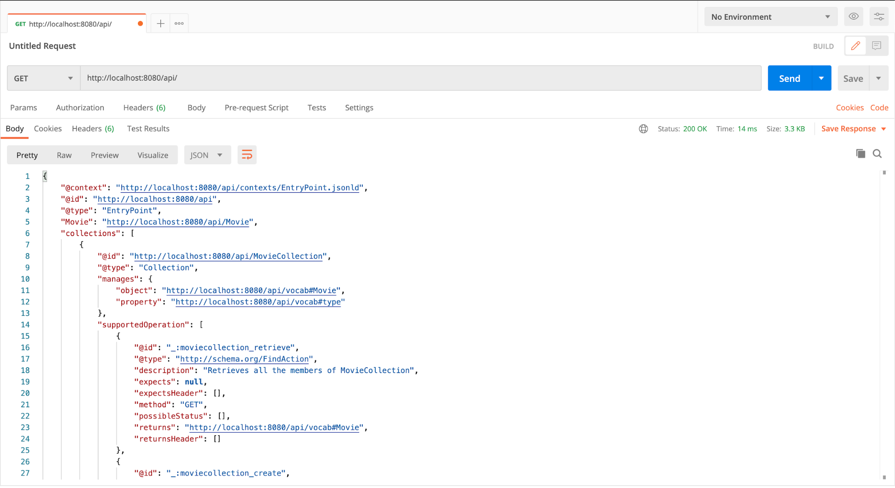
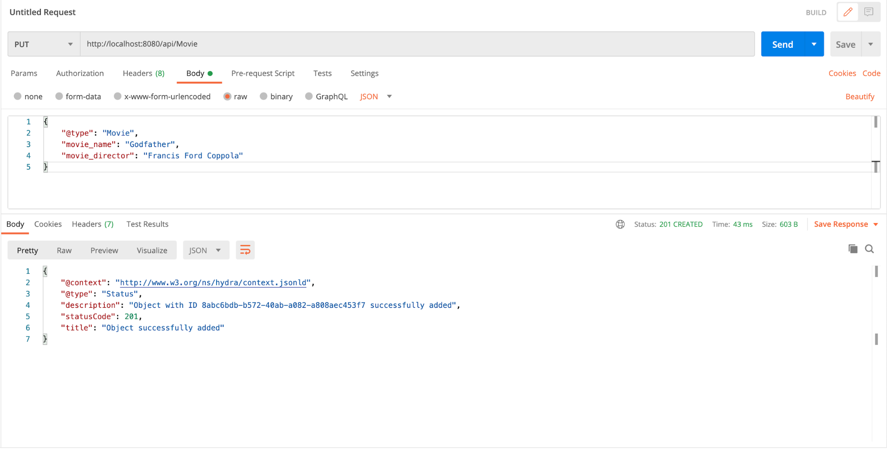
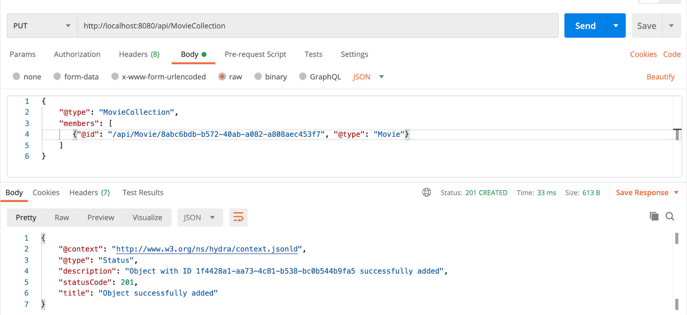
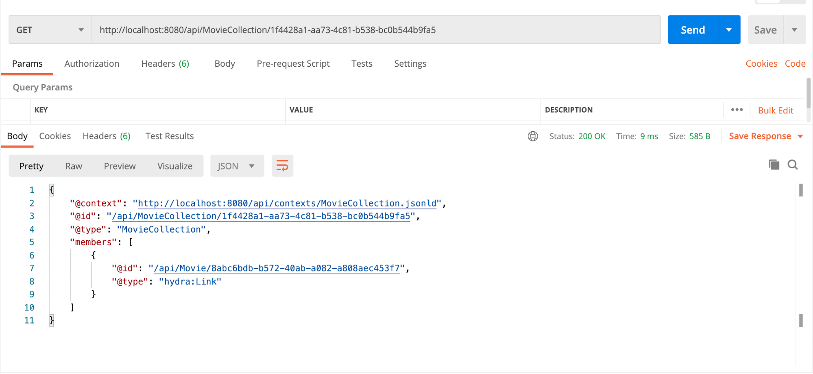

# Making CRUD Operations using Hydrus

> You should have hydrus up and running to follow along with this tutorial. To start hydrus please visit this tutorial. You should also have [Postman](https://www.postman.com/) or a similar tool installed.

To check if `hydrus` is up and running, go to Postman and make a `GET` request to `http://localhost:8080/api`. You should see the following response on Postman:



REST is about resources. Most of the time we are dealing with the resources. Common operations include creating resources, updating resources, getting the resources, or deleting the resources. Hydrus uses the HTTP verbs to carry out these operations. It uses GET to get the resources, PUT to add a resource, POST to modify a resource, and DELETE to delete a resource.

In Hydra dereferenceable resources are called classes. A resource, in general, can or can’t be dereferenceable. A `hydra:Collection` is a set of somehow related resources. It can contain members of different types. The entry point lists all the resources defined in APIDoc such as Movie and Movie Collection. The Movie or Movie Collection resources supports only the operations that are described by `hydra:supportedOperation`.

## Adding a resource

Let’s start by adding a movie. To add a movie, in Postman make a PUT request to `http://localhost:8080/api/Movie` with the following request body in JSON:

```json
{
  "@type": "Movie",
  "movie_name": "Godfather",
  "movie_director": "Francis Ford Coppola"
}
```



The object was successfully added. The response returns with an Object ID which can be used to dereference this Movie. To see the added Movie make a GET request to `http://localhost:8080/api/Movie/<object-id>`.

## Modifying a resource

Let’s change the director’s name from Francis Ford Coppola to F.F. Coppola. To modify a request make a POST request to `http://localhost:8080/api/Movie/<object-id>`. Object Id being the ID of the resource to be modified, with the request body as

```json
{
  "movie_name": "Godfather",
  "movie_director": "F.F Coppola",
  "@type": "Movie"
}
```

This will modify the resource with an updated movie_director name.

## Getting a resource

To check if the resource was updated make a GET request at the same URL and you show can see the updated response.

## Creating a Collection

Now, add this Movie to a collection. To create a collection and add movies to it make a PUT request to [http://localhost:8080/api/MovieCollection](http://localhost:8080/api/MovieCollection) with the request body in JSON containing the IDs of movies to add, and their type:

```json
{
  "@type": "MovieCollection",
  "members": [
    {
      "@id": "api/Movie/eba1eaa2-8acb-476c-a9a7-6bb165ad6716",
      "@type": "Movie"
    }
  ]
}
```



The response will contain the ID of the new collection.

## Getting a Collection

To view, the new collection just created make a GET request to http://localhost:8080/api/MovieCollection/&lt;collection-id>



## Updating a Collection

Updating a collection is very much similar to creating a collection. It takes in the members array to update the list of resources. For eg: to replace the current movie in the collection with something else we can make a POST request to [http://localhost:8080/api/MovieCollection/](http://localhost:8080/api/MovieCollection/)&lt;collection-id> with the updated members:

```json
{
  "@type": "MovieCollection",
  "members": [
    {
      "@type": "Movie",
      "@id": "/api/Movie/sdjhf-sdgjkhf-ksdjfgh"
    }
  ]
}
```

Note that these members should exist before they are added to the collection.

## Deleting Class Instances and Collection Instances

To delete a resource simply make a DELETE operation on the [http://localhost:8080/api/Movie/](http://localhost:8080/api/Movie/)&lt;resource-id>. Similarly to delete a collection, make DELETE operation to [http://localhost:8080/api/MovieCollection/](http://localhost:8080/api/Movie/)&lt;collection-id>.

Note that we were making GET, PUT, POST, DELETE operation because we had specified them on the APIDoc created in Tutorial 2. It might not always be the case. Also we did not pass any additional headers because we had disabled the Authentication. Many a times we want protected routes. See the How-to-Guides on How to use Authentication.

## In this document you learned about:

- Hydra classes and collection
- CRUD operation on Hydra classes
- CRUD operation on Hydra collection

Now, move on next tutorial, Using Agent to make CRUD operations ➡️
