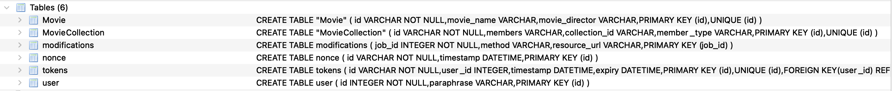

# Setting Up and Running hydrus

> This tutorial assumes you have a basic understanding of Python programming language, [Hydra](http://www.hydra-cg.com/spec/latest/core/), API documentation created using [Hydra](http://www.hydra-cg.com/spec/latest/core/), Linked Data, web servers, and REST APIs.

You will learn about `hydrus` and be able to set up and run `hydrus` in two different ways after following this document.

[`hydrus`](https://github.com/HTTP-APIs/hydrus) is a generic server that can serve required data and metadata(in the form of API documentation) to a client over HTTP. It utilizes the power of Linked Data to create powerful REST APIs to serve data. Hydrus uses the [Hydra(W3C)](http://www.hydra-cg.com/spec/latest/core/) standard for the creation and documentation of its APIs.

`hydrus` can be used in two different ways.

1. As a Python package.
2. As a Command Line Interface. (CLI).

## Using hydrus as a Python Package

`hydrus` makes creating and spinning up a semantic web server easy by giving the developers ability to import it as a Python package. It provides intuitive interfaces to work with and can be easily configured according to one's preferences.

To use it as a Python package follow the steps below:

1. Navigate into the `creating_api_doc` directory as created in tutorial 2 [Insert link]
2. Activate the virtual environment by typing `source activate`
3. Create a new file `index.py`. This file will use `hydrus` to spin up a semantic web server.
4. Run `pip install git+https://github.com/HTTP-APIs/hydrus.git#egg=hydrus` (This step can be tricky as `hydrus` depends on few platform-dependent packages, be sure to check out FAQs if you face any problem).
5. In the `index.py` file start by importing the required modules.

```Python
from sqlalchemy import create_engine
from sqlalchemy.orm import sessionmaker

from hydrus.app_factory import app_factory
from hydrus.utils import set_session, set_doc, set_hydrus_server_url, set_api_name
from hydra_python_core import doc_maker
from hydrus.data.db_models import Base, create_database_tables
from api_doc_output import doc
```

The above code sample imports:

- `create _engine` - The database models use SQLAlchemy as an ORM Layer, mapping relations to python Classes and Objects. The `create_engine` method creates the engine. An Engine is the starting point for any SQLAlchemy Application. This engine acts as a connection on which we can create sessions to interact with the database.
- `sessionmaker` - It generates a new session when invoked.
- `app_factory` - This method takes in API_NAME as a parameter. It creates an API with all routes of the app directed at /[API_NAME].
- `set_session`, `set_doc`, `set_hydrus_server_url`, `set_api_name` are setters which set DB session, docs, server_url and api_name respectively. These methods put together all the things required to run `hydrus`.
- `doc_maker` from the [core library](https://github.com/HTTP-APIs/hydra-python-core) to create the APIDoc.
- `Base` class constructs a base class for the declarative class definition.
  `hydrus` defines models by sub-classing the Base class. `hydrus` has its database model that is unique to the provided APIDoc. `create_database_tables` is a helper method to create all the tables according to the APIDoc.
- `doc` - The APIDoc of movie API generated in Tutorial 2 [Insert Link]

6. Define params, add the models to DB and start the DB session:

```python
#Define the server URL, this is what will be displayed on the Doc
HYDRUS_SERVER_URL = "http://localhost:8080/"

#The name of the API or the EntryPoint, the api will be at http://localhost/<API_NAME>
API_NAME = "api"
# Define the Hydra API Documentation
# NOTE: You can use your own API Documentation and create a HydraDoc object using doc_maker
# Or you may create your own HydraDoc Documentation using doc_writer
apidoc = doc_maker.create_doc(doc, HYDRUS_SERVER_URL, API_NAME)
# Define the database connection. Any Database can be used.
engine = create_engine('sqlite:///database.db')
# Get all the classes from the doc
classes = doc_parse.get_classes(apidoc)
# Drop all existing models and add the new ones.
Base.metadata.drop_all(engine)
Base.metadata.create_all(engine)
# create the DB tables
create_database_tables(classes)
# Start a session with the DB and create all classes needed by the APIDoc
session = sessionmaker(bind=engine)()
```

The above code sample:

- Assigns hydrus_server_url to “http://localhost:8080”. This sets the base URL in the APIDoc.
- Assigns the api_name to `api`.
- Creates the APIDoc from the `doc_maker` module by hydra_python_core. It converts the doc into python classes which the `hydrus` and agent can understand.
- Creates the SQL Alchemy engine. (Note that we have used SQLite as a database here, but other databases can also be used here. List of supported databases [here](https://docs.sqlalchemy.org/en/13/orm/tutorial.html).)
- Adds all the predefined models to the database.
- Starts the database session.

7. Create a `hydrus` app and start the server

```python

# Create a hydrus app with the API name you want, default will be "api"
app = app_factory(API_NAME)

# Set the name of the API
with set_api_name(app, API_NAME):
   # Set the API Documentation
   with set_doc(app, apidoc):
       # Set HYDRUS_SERVER_URL
       with set_hydrus_server_url(app, HYDRUS_SERVER_URL):
           # Set the Database session
           with set_session(app, session):
               # Start the hydrus app
               app.run(host='127.0.0.1', debug=True, port=8080)
```

The above code sample:

- Creates a new `hydrus` app and gives it a name.
- Calls the setter functions defined in the `hydrus.utils` module, the use of these pluggable methods requires an app context which is a variant of the python context, similar to the request context in most servers. Due to this, the python keyword with must be used to create a context in which the application must run.
- Finally, runs the app at http://localhost:8080/api in debug mode.

`hydrus` creates and sets up the database out of the box. For the APIDoc used in this document following DB structure is created:



> Note: The `hydrus` app is a modified instance of the Flask app with the required operations and routes predefined. All options and operations on the app object will be the same as those done in the Flask app.

8.Start the app by `python3 index.py` in the terminal.

9.Browse http://localhost:8080/api to see the response!

The complete `index.py` file can be found [here](https://gist.github.com/priyanshunayan/a2de41705aaf9fd0e43508ef12a916f4)

## Using hydrus as a Command Line Interface (CLI)

`hydrus` can be used a Command Line Interface (CLI). The CLI can be used to quickly start a server. `hydrus` can take in number of arguments. An example is `hydrus serve --api hydrus --port 9000 --adduser 1 test2`. This command starts the server, names the API as hydrus and serves at port 9000.

To use `hydrus` as CLI, follow the steps:

1. Install hydrus from git: `git clone https://github.com/hydrus.git`
2. Navigate to `hydrus` directory by running `cd hydrus`
3. Create a virtual environment by `Python3 -m venv venv`
4. Activate the virtual environment by `source activate`
5. Install requirements of hydrus by: `pip install -r requirements.txt` <!-- Or install by poetry -->
6. Run `python3 setup.py install`
7. Run `hydrus serve --no-auth` (--no-auth param disables the authentication. See hydrus --help for more options).
8. Browse http://localhost:8080/api to see the response

### In this tutorial, you learned about:

1. `hydrus` - a semantic web server
2. Using `hydrus` as Python package
3. Using `hydrus` as Command Line Interface.

Now move on to the next tutorial _Using hydrus to make CRUD operations_ ➡️
