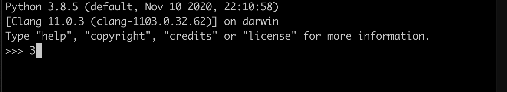

# Using Agent to query Hydrus

> You should have `hydrus` up and running. For instructions on how to start a hydrus server, checkout the quick start guide. To follow along you also need to have `git`  and `python3` installed.

`hydra-python-agent` or Agent is the smart Hydra client implemented in Python. The Agent is a smart client which is generic and automated that can establish resilient connected data networks leveraging knowledge graph.

`hydra-python-agent` exposes multiple convenient interfaces:

- A Python package - To make communication with a Hydra API easier in the software.
- Natural-language-like command line tool - This is a GET only implementation for now. It is in development.


Some of the important features of `hydra-python-agent` are:

1. It provides a seamless client that can be used to communicate with Hydra APIs.
2. It caches metadata from the Hydra server it connects to, to allow querying on the client-side.
3. It maintains a synchronization mechanism which makes sure cached resources are consistent.
4. It allows the graph to be queried using OpenCypher.

## To use agent as a package in REPL:

1. Clone the repository by running this command in the terminal: `git clone https://github.com/HTTP-APIs/hydra-python-agent.git`.
2. Navigate into the repository by running: `cd hydra-python-agent`
3. Create a new virtual environment named agent: `python3 -m venv agent`.
4. Activate this virtual environment: `source agent/bin/activate`.
5. Install the necessary package: `pip install -r requirements.txt`. After this run: `python3 setup.py install`.
6. Start the redis server: `docker run -p 6379:6379 -it --rm redislabs/redisgraph:2.0-edge`. The agent uses redis to cache the meta data to make query faster.
7. Start the python3 REPL by typing `python3` and pressing enter. You should see something like this:
   
8. In the REPL, import Agent:

```python
from hydra_agent.agent import Agent
```

9.  Connect Agent to hydrus by passing in the URL. The `Agent` is the factory class that returns the instance of the agent. All the CRUD operations can be invoked on this instance.

```python
agent = Agent("http://localhost:8080/serverapi") # serverapi is the name of the API.
```

10. Once connected, we can now make CRUD operations.

## Making CRUD Operations on Classes

To GET an existing resource make a GET request to: <!-- Insert Images of responses -->

```python
agent.get("http://localhost:8080/serverapi/<ResourceType>/<Resource-ID>")
agent.get("http://localhost:8080/serverapi/<CollectionType>/")
agent.get("http://localhost:8080/serverapi/<CollectionType>/<Collection-ID>")
```

You should see the response. <!-- Add a screenshot -->

To add a resource make a PUT request with the resource as the second parameter:

```python
new_resource = {
    "@type": "Drone",
    "DroneState": {
        "@type": "State",
        "Battery": "50%",
        "Direction": "N",
        "Position": "50.34",
        "SensorStatus": "Active",
        "Speed": "100"
    },
    "MaxSpeed": "500",
    "Sensor": "Active",
    "model": "Drone_1",
    "name": "Drone1"
}
agent.put("http://localhost:8080/serverapi/Drone/", new_resource)
```

To update the resource Agent exposes the POST interface:

```python
existing_resource["name"] = "Updated Name"
agent.post("http://localhost:8080/serverapi/<ResourceType>/<Resource-ID>", existing_resource)
```

To delete an existing resource, use the delete method:

```python
agent.delete("http://localhost:8080/serverapi/<ResourceType>/<Resource-ID>")
```

## Making CRUD Operations on Collections

To add members in the collection:

```
request_body = {
    "@type": "<CollectionType>",
    "members": [
        {
            "@id": "<ResourceID>",
            "@type": "<ResourceType>"
        },
        {
            "@id": "<ResourceID>",
            "@type": "<ResourceType>"
        },
    ]
}
agent.put("http://localhost:8080/serverapi/<CollectionType>", request_body)
```

NOTE: \<ResourceType\> can be different in given request body.

TO GET members of specific Collection:

```python
agent.get("http://localhost:8080/serverapi/<CollectionType>/<CollectionID>")
```

TO DELETE members of specific Collection:

```python
agent.delete("http://localhost:8080/serverapi/<CollectionType>/<CollectionID>")
```

More than that, `Agent` class extends Session from https://2.python-requests.org/en/master/api/#request-sessions, so all methods like auth, cookies, headers and so on can also be used.

### In this Tutorial you learnt about:

- smart clients
- `hydra-python-agent`
- Making CRUD operations using `hydra-python-agent` on classes
- Making CRUD operations using `hydra-python-agent` on Collections
