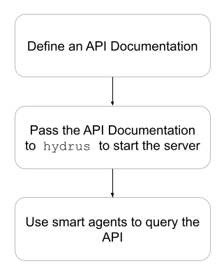

# General Workflow

> Before understanding the general workflow of creating and then using the APIs, you should be familiar with hydra, linked data, JSON-LD and Web APIs. If you are familiar with these technologies, jump [here](#main).

## Familiarising with Hydra

The [specification](http://www.hydra-cg.com/spec/latest/core/) defines Hydra as:

> a lightweight vocabulary to create hypermedia-driven Web APIs. By specifying a number of concepts commonly used in Web APIs it enables the creation of generic API clients.

Hydra enables a server to advertise valid state transitions in a machine processable way. The information can be changed or modified at a runtime which the agents can understand and adept. The agents which can comprehend these changes are referred to as smart clients.

The smart client looks for the API Documentation(APIDoc) in the Link header, extracts the entry point to find different routes and then the supported operations and properties for each route on the runtime. These concepts are formalised by the hydra vocabulary.

## Linked Data

[Tim Berners Lee](https://www.w3.org/DesignIssues/LinkedData.html) defines Linked data as:

> The Semantic Web isn't just about putting data on the web. It is about making links, so that a person or machine can explore the web of data. With linked data, when you have some of it, you can find other, related, data.

There are three rules that the linked data should follow:

1. Use URI for names of things
2. Use HTTP URIs so that people can look up those names.
3. When someone looks up a URI, provide useful information, using the standards.
4. Include links to other URIs. so that they can discover more things.

With Linked data it becomes easy to integrate different datasets together to achieve different goals. One of the common examples of Linked data dataset is [DBPedia](https://wiki.dbpedia.org/)(the dataset of wikipedia in Linked data format).

## JSON-LD

[JSON-LD](https://json-ld.org/) is a JSON based format to serialise linked data. It annotates the elements of the response and structures the data which helps to disambiguate different data and helps machines better understand the data.
For example, any human can comprehend that the following response contains data about the name Hydra Ecosystem and contains the url of home page. But machines cannot make any sense from the following data.

```json
{
  "name": "Hydra Ecosystem",
  "homepage": "https://hydraecosystem.org/"
}
```

To resolve this, one can use unambiguous identifiers for the name and URL and specify that if the value is an IRI or a string literal. JSON-LD can be used to achieve this by using a popular schema.org vocabulary:

```json
{
    "http://schema.org/name": "Hydra Ecosystem",
    "http://schema.org/url": {
        "@id": "https://hydraecosystem.org/"
        ↑ The '@id' keyword means 'This value is an identifier that is an IRI
    }
}
```

## Web APIs

A Web API is an application programming interface for either a web server or a web browser. One can get the data without bothering about the implementation details. For example to get the weather information of a place, one need not to bother about how the weather is measured. A request to the URL of the API returns with the weather information.

<div id="main">
After going through this document, you should be able to understand the general workflow followed to create and use APIs using the tools of the Hydra Ecosystem. Though the workflow might be different for few use cases, this document tries to cover the general workflow that can satisfy most of the use cases.
</div>

To design web APIs using the tools of this ecosystem, follow three simple steps.

1. Define the API in JSON-LD format as API Documentation
2. Pass this API Documentation to the `hydrus` server
3. Use Smart clients(`hydra-python-agent`) to consume APIs served by the `hydrus`.

<!-- Insert the Illustration about the different components here -->



## 1. Defining the API Documentation

Define the API documentation(APIDoc) by using the tool `hydra-python-core`. `hydra-python-core` provides convenient interfaces for describing the API in the hydra parlance, i.e, the supported classes, supported operations along with the other properties defined by the hydra specification.

`hydra-python-core` can also accept the predefined APIDoc in JSON-LD.

It changes the existing APIDoc in JSON-LD to Python Classes which the tools like `hydra-python-agent` and `hydrus` can understand.

<!-- How to deal with the openAPI format -->

The APIDoc in the OpenAPI format should be first converted into the JSON-LD by the parser(`openapi-to-hydra`) before passing the APIDoc to the `hydrus`.

## 2. Passing the API documentation to `hydrus`

`hydrus` accepts the APIDoc as a parameter and spins up a server, and exposes routes for every Hydra Class and Collection with the allowed operations as defined in the APIDoc. One can configure the authentication mechanism, and the database.

Hydrus can be used a Command Line Interface(CLI) and as a python package.

## 3. Using smart Clients to consume APIs

Once the server is up and running, any smart agent like `hydra-python-agent` can consume the APIs .`hydra-python-agent` can be used in a REPL or as a python package to interact with `hydrus` or any http powered web server.

### To Summarise, from this document you:

- Learnt about hydra, json-ld, linked data and web APIs.
- Learnt about the general workflow to follow to create and use web APIs.
- Learnt about the different tools of the hydra ecosystem

Now, move on to the next section [Creating a sample APIDoc ➡️](https://google.com)
