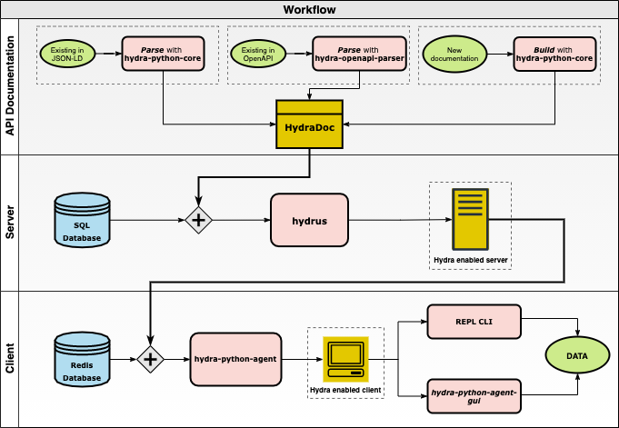

# General Workflow

> This document assumes no prerequisites. If you are familiar with Hydra, Linked Data (W3C), and Web API jump [here](#main).

## Familiarizing with Hydra

The [specification](http://www.hydra-cg.com/spec/latest/core/) defines Hydra as:

> a lightweight vocabulary to create hypermedia-driven Web APIs. By specifying a number of concepts commonly used in Web APIs it enables the creation of generic API clients.

Hydra enables a server to advertise valid state transitions in a machine-processable way. The information can be changed or modified at a runtime which the agents can understand and adapt to it. In Hydra Ecosystem the smart client is called a 'agent'.

The smart clients look for the API Documentation(APIDoc) in the Link header. The APIDoc is a completely machine-processable document. It is the foundation of the description of the Web API. It describes the API by giving it a title, a short description, and documenting its main entry point. The supported operations, status codes that might be returned can also be documented. Hydra vocabulary formalizes these concepts. To know more in-depth, consider reading [official specification.](http://www.hydra-cg.com/spec/latest/core/#documenting-a-web-api)

## Linked Data

[Tim Berners Lee defines](https://www.w3.org/DesignIssues/LinkedData.html) linked data as:

> The Semantic Web isn't just about putting data on the web. It is about making links so that a person or machine can explore the web of data. With linked data, when you have some of it, you can find other, related, data.

There are three rules that the Linked Data (W3C) should follow:

1. Use URI for names of things
2. Use HTTP URIs so that people can look up those names.
3. When someone looks up a URI, provide useful information, using the standards.
4. Include links to other URIs. so that they can discover more things.

With Linked Data (W3C), it becomes easy to integrate different datasets to achieve conceived goals. One of the common examples of Linked data dataset is [DBPedia](https://wiki.dbpedia.org/)(the dataset of Wikipedia in Linked Data(W3C) format).

## JSON-LD

[JSON-LD](https://json-ld.org/) is a JSON based format to serialize Linked Data (W3C). It annotates the elements of the response and structures the data which helps to disambiguate different data and helps machines better understand the data.
For example, any human can comprehend that the following response contains data about the name Hydra Ecosystem and contains the URL of the home page. But machines cannot make any sense from the following data.

```json
{
  "name": "Hydra Ecosystem",
  "homepage": "https://hydraecosystem.org/"
}
```

To resolve this, one can use unambiguous identifiers for the name and URL and specify that if the value is an IRI or a string literal. JSON-LD can be used to achieve this by using a popular schema.org vocabulary: <!-- Insert link -->

```json
{
    "http://schema.org/name": "Hydra Ecosystem",
    "http://schema.org/url": {
        "@id": "https://hydraecosystem.org/"
        ↑ The '@id' keyword means 'This value is an identifier that is an IRI
    }
}
```

## Web APIs

A Web API is an application programming interface for either a web server or a web browser. One can get the data without bothering about the implementation details. For example, to get the weather information of a place, one need not to bother about how the weather is measured. A request to the URL of the API returns with the weather information.

<div id="main">
After going through this document, you will understand the general workflow followed to create and use APIs using the tools of the Hydra Ecosystem.
</div>

To design web APIs using the tools of this ecosystem, follow three simple steps.

1. Define the API in JSON-LD format as API Documentation
2. Pass this API Documentation to the `hydrus` server
3. Use Smart clients(`hydra-python-agent`) to consume APIs served by the `hydrus`.

See the following image to get an idea of how different components of the Hydra Ecosystem interact with each other:



## 1. Defining the API Documentation

Define the API documentation(APIDoc) by using the tool `hydra-python-core`. `hydra-python-core` provides convenient interfaces for describing the API in Hydra parlance in Python programming language, i.e the supported classes, supported operations along with the other properties defined by the Hydra specification.

`hydra-python-core` also accepts the predefined APIDoc in JSON-LD format and in OpenAPI format. To convert the APIDoc from OpenAPI format to JSON-LD format use [`hydra-openapi-parser`](https://github.com/HTTP-APIs/hydra-openapi-parser).

`doc_maker` module of `hydra-python-core` changes the existing APIDoc in JSON-LD to Python classes using the `doc_writer` module, which the tools like `hydra-python-agent` and `hydrus` can understand.

## 2. Passing the API documentation to `hydrus`

`hydrus` accepts the APIDoc as a parameter and spins up a server, and exposes routes for every Hydra Class and Collection with the allowed operations as defined in the APIDoc. One can configure the authentication mechanism and the database.

`hydrus` can be used as a Command Line Interface(CLI) and as a python package.

`hydrus` can be connected with agents using web sockets as well as without it. `hydrus` uses web sockets to sync data between multiple clients connected to it by using message-passing protocol.

## 3. Using smart clients to consume APIs

Once the server is up and running, any smart agent like `hydra-python-agent` can consume the APIs. `hydra-python-agent` can be used in a REPL or as a python package to interact with `hydrus` or any http powered web server.

The [GUI](https://github.com/HTTP-APIs/hydra-python-agent-gui) is built on the top of the `hydra-python-agent` to interact with the server. It is built up of two components - graph and a form. Graph represents the APIDoc in graphical format. One can use the forms to create different type of requests to the `hydrus`.


### To Summarise, from this document you:

- Learnt about Hydra, JSON-LD, Linked Data (W3C), and web APIs.
- Learnt about the general workflow to follow to create and use web APIs.
- Learnt about the different tools of the Hydra ecosystem

Now, move on to the next section [Creating a sample APIDoc ➡️](https://google.com)
